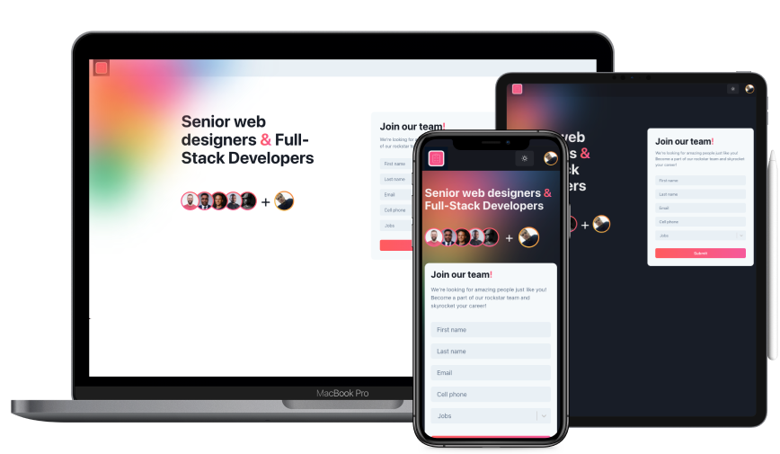

<h1 align="center">
  
</h1>

<div align="center">

<!-- Badges -->


</div>

---

<p align="center">
  <a href="#dart-about">:dart:&nbsp;&nbsp;About</a> &nbsp; | &nbsp; 
  <a href="#rocket-technologies">:rocket:&nbsp;&nbsp;Technologies</a> &nbsp; | &nbsp;
  <a href="#white_check_mark-requerimentos">:white_check_mark::&nbsp;&nbsp;Requerimentos</a> &nbsp; | &nbsp;
  <a href="#checkered_flag-começando">:checkered_flag::&nbsp;&nbsp;Começando</a>

  

  <a href="https://job-contact.netlify.app"></a>

</p>

<br>

## :dart: Sobre ##

The project  is a study with [React Hook Form](https://react-hook-form.com), [Chakra UI](https://chakra-ui.com) and [Yup](https://github.com/jquense/yup) library.

## :rocket: Technologies ##

This project was developed with the following technologies:

- [Next.js](https://nextjs.org/)
- [React Hook Form](https://react-hook-form.com)
- [Chakra UI](https://chakra-ui.com)
- [Yup](https://github.com/jquense/yup)
- [React Select](https://react-select.com)
- [React Number Format](https://github.com/s-yadav/react-number-format)
- [Sass](https://sass-lang.com)

## :white_check_mark: Requirements ##

- [Git](https://git-scm.com/)
- [Node](https://nodejs.org/en/)
- [Yarn](https://yarnpkg.com/lang/en/)

## :checkered_flag: Starting ##

```bash
# Clone this project
$ git clone git@github.com:KaiqueCovo/form-with-react-hook-form.git

# Go into the repository
$ cd form-with-react-hook-form

# Install dependencies
$ yarn install

# Run the project
$ yarn dev
```

---
Made with ♥  by [Kaique Covo](https://www.linkedin.com/in/kaique-covo-a46331147/) :wave: